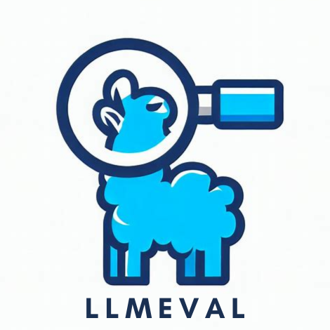

# LLMEVAL-1 中文大语言模型评测第一期

<div align=center></div>

## 项目简介

自2022年以来，大量不同类型的大模型评测方法相继涌现。然而，为了方便进行自动化评测，目前的评测方法主要采用选择题或者依赖GPT-4进行评估。虽然选择题能够方便进行自动化处理，但其无法有效评估大模型最为关键的生成能力，仅在一定程度上反映模型的知识覆盖范围。尽管GPT-4的自动评测模型可以对文本生成能力进行评估，但我们仍缺乏大规模数据对比分析，无法确定其结果与人工评测之间的实际差距。
LMEVAL系列评测旨在系统研究大模型评价方法，并试图回答以下几个关键问题：

问题一：应该从哪些方面评测大模型？

问题二：应该用什么方法评测大模型？

问题三：应该使用什么方法进行排序？

为此，本次评测涵盖了17个大类、453个问题，包括事实性问答、阅读理解、框架生成、段落重写、摘要、数学解题、推理、诗歌生成、编程等各个领域。
在这些问题上，为大模型的回答设置了5个评分项，分别是：正确性、流畅性、信息量、逻辑性和无害性。
在构造了评测目标的基础上，有多种方法可以对模型进行评测。包括分项评测、众包对比评测、公众对比评测、GPT 4自动分项评测、GPT 4 对比评测等方式。

## 排行榜
| 模型名称            | 分项测评       |        |             |                   |              |              |                | 对比测评      |             |
|:-------------------|:-------------|:-------|:-------------|:------------------|:-------------|:-------------|:---------------|:-------------|:------------|
|                    | 综合          | 排名   | 准确率     | 信息量   | 流畅性      | 逻辑性   | 无害性   | 对比打分     | 排名   |
| GPT4.0             | 2.833(2.917) | 1(1)   | 2.709(2.803) | 2.817(2.882)      | 2.870(3.000) | 2.832(2.901) | 2.937(3.000)   | 0.701(0.894) | 1(1)        |
| GPT3.5             | 2.789(2.878) | 2(2)   | 2.616(2.717) | 2.742(2.807)      | 2.850(3.000) | 2.785(2.868) | 2.954(2.998)   | 0.643(0.818) | 2(2)        |
| Xunfei-Xinhuo      | 2.639(2.724) | 3(4)   | 2.391(2.427) | 2.523(2.564)      | 2.745(2.987) | 2.633(2.646) | 2.904(2.996)   | 0.550(0.623) | 5(3)        |
| Chat-Baichuan-7B   | 2.633(2.821) | 4(3)   | 2.401(2.651) | 2.453(2.709)      | 2.720(2.998) | 2.627(2.753) | 2.964(2.993)   | 0.603(0.621) | 3(4)        |
| ChatGLM-6B         | 2.597(2.644) | 5(7)   | 2.323(2.312) | 2.504(2.442)      | 2.703(2.956) | 2.555(2.518) | 2.899(2.989)   | 0.579(0.547) | 4(5)        |
| Chinese-LLAMA-7B   | 2.571(2.723) | 6(5)   | 2.293(2.431) | 2.394(2.549)      | 2.696(2.993) | 2.553(2.646) | 2.919(2.998)   | 0.506(0.457) | 6(7)        |
| Ali-Tongyiqianwen  | 2.523(2.646) | 7(6)   | 2.203(2.309) | 2.339(2.403)      | 2.670(2.983) | 2.530(2.542) | 2.875(2.991)   | 0.491(0.507) | 7(6)        |
| NewBing            | 2.464(2.622) | 8(8)   | 2.127(2.263) | 2.144(2.320)      | 2.607(2.996) | 2.550(2.531) | 2.892(2.998)   | 0.415(0.425) | 9(8)        |
| MOSS-16B           | 2.337(2.518) | 9(10)  | 1.994(2.109) | 2.054(2.173)      | 2.498(2.974) | 2.288(2.370) | 2.849(2.965)   | 0.377(0.272) | 11(10)      |
| Linly-ChatFlow-13B | 2.312(2.534) | 11(9)  | 1.966(2.158) | 2.067(2.257)      | 2.408(2.928) | 2.288(2.351) | 2.830(2.976)   | 0.398(0.339) | 10(9)       |
| ChatYuan-Large     | 2.312(2.411) | 11(12) | 1.933(1.961) | 2.095(2.056)      | 2.458(2.851) | 2.247(2.195) | 2.826(2.994)   | 0.426(0.245) | 8(12)       |
| MOSS-w-Plugin-16B  | 2.310(2.506) | 12(11) | 1.966(2.101) | 1.964(2.150)      | 2.499(2.963) | 2.285(2.352) | 2.834(2.967)   | 0.352(0.254) | 12(11)      |

*注：括号内数值为GPT-4自动测评的打分及排名

## NEWS
### 2023.06.19 - 测试结果发布

在过去的一个月中，共有2186位用户参与评测，提交了总计24.3万个评测结果。此外，我们还利用GPT 4 API进行了5.75万次自动评测。本次评测涵盖了17个大类、453个问题，包括事实性问答、阅读理解、框架生成、段落重写、摘要、数学解题、推理、诗歌生成、编程等各个领域。
https://mp.weixin.qq.com/s/FeAH_30IkXHNfywKXoog1w

### 2023.05.24 - 中期进展公布

5月24日，大众匿名评测标注已达到预定目标的约30%，专业评测已完成总量的40%。LLMEVAL自推出以来，就受到了多方的广泛关注，为了能够满足大家的对该项目的期待，我们整理发布了初步评测结果。目前参与评测人员超过2000人，投票数量接近5.8万次。
https://mp.weixin.qq.com/s/frAi29mgQE482hpgztHcPA

### 2023.05.01 - 测试发布
由于现代大模型主要侧重于文本生成能力，传统的BLUE值、ROUGE、精确率、召回率等评测指标已经无法充分反映出系统的实际效能。对于ChatGPT等类似的系统和模型，我们也迫切需要一种更专业、更大规模的评测方法和评测集合。因此，我们决定从认知心理学的角度出发，以人类处理信息、思考和解决问题的能力为基准，构建了一套包含17类，438条任务的全新评测问题集。我们采用众包与专业相结合的方式，匿名化系统名称，并通过对比评测的方式构建了LLMEVAL评测集，期待你的积极参与。
https://mp.weixin.qq.com/s/0ZxX58FZxX6R_YY2sTEPig

## Citation

If you find this repository useful, please cite our project:
```
@misc{LLMEval1,
  author = {Ming Zhang and Yue Zhang and Shichun Liu and Haipeng Yuan and Junzhe Wang and Tao Gui and Qi Zhang and Xuanjing Huang},
  title = {{LLMEval-1}},
  year = {2023},
  month = {June},
  url = {https://github.com/llmeval/llmeval-1},
}
```
